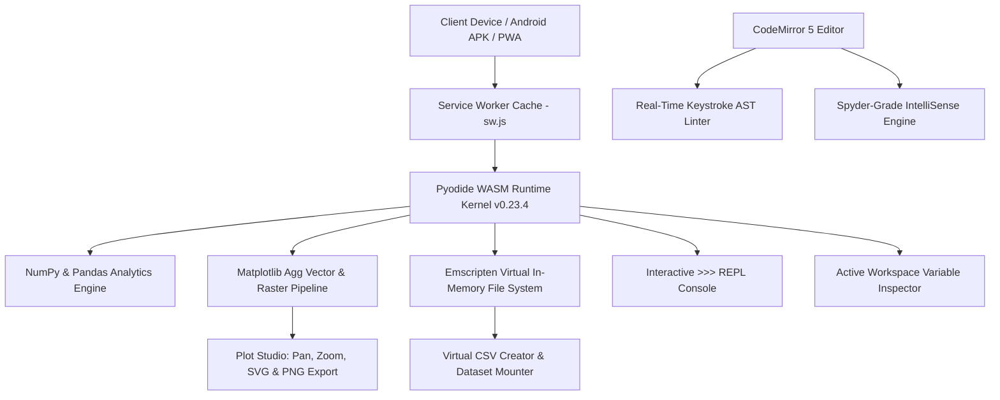

<div align="center">

# ⚡ Omni-Studio
### High-Performance Offline Computational Python, Physics & Data Science Lab

[](https://shadow-wave.github.io/Omni-pro/)
[](https://github.com/shadow-wave/Omni-pro/releases/latest)
[](https://shadow-wave.github.io/Omni-pro/)
[](https://pyodide.org/)
[](LICENSE)

<p align="center">
  A mobile-first, zero-install Python 3 IDE executing natively on-device via WebAssembly.<br>
  <b>Zero Cloud Backend • 100% Client-Side Privacy • Real-Time AST Linting • High-DPI Responsive Plot Studio</b>
</p>

### [🚀 **Launch Omni-Studio in Browser**](https://shadow-wave.github.io/Omni-pro/) &nbsp;&bull;&nbsp; [📱 **Download Latest Android APK**](https://github.com/shadow-wave/Omni-pro/releases/latest)

---

</div>

## 🌟 Overview

**Omni-Studio** is an advanced computational development suite engineered for physics and mathematics students, researchers, educators, and data science practitioners. It delivers a desktop-grade Python 3 workstation experience across smartphones, tablets, iPads, laptops, and PCs—completely free of local terminal configurations, cloud server dependencies, or subscription fees.

Driven by an in-browser **Pyodide WebAssembly (WASM)** kernel, Omni-Studio operates 100% offline via Progressive Web App (PWA) cache-first protocols and standalone Android builds. It computes NumPy calculations, executes Pandas DataFrame pipelines, and generates Matplotlib figures directly inside device memory with hardware-accelerated speed.

---

## ⚡ Core Architecture & Runtime Workflow

Omni-Studio links CodeMirror, an Emscripten virtual filesystem, background AST workers, and Pyodide:



---

## 🚀 Key Features & Architectural Capabilities

### 1. 🖥️ Resizable Dual-Pane Split View
* **Side-by-Side Workstation**: Toggle split mode (`Alt + S`) to run the Python code editor on the left pane and output modules (Terminal Console, Plot Studio, Variable Explorer, Syllabus) on the right.
* **Draggable Split Divider**: Freely adjust workspace distribution (from 20% to 80%) with mouse or touch gestures. Double-clicking the divider instantly resets panes to an even 50/50 ratio.
* **Auto-Dock Hiding**: Entering split mode automatically hides the mobile navigation dock, granting full vertical height to code and scientific visualizers.
* **Flawless Mode Transition**: Restoring single-pane mode seamlessly expands the active panel to 100% width and height without layout displacement.

### 2. 💡 Spyder-Grade IntelliSense & Autocompletion Engine
* **Viewport-Anchored Dropdown**: Smart floating suggestion window dynamically pinned to the typing caret. Automatically detects screen boundaries and flips above the current line when near the bottom edge.
* **Smart Statement Completion**: Real-time popups for `import` and `from` statements, auto-suggesting aliases (`numpy as np`, `pandas as pd`, `matplotlib.pyplot as plt`, `math`, `scipy`, `sympy`, `pypdf`, `itertools`).
* **Scientific Dot Catalog**: Instant method suggestions for `np.`, `pd.`, `plt.`, `df.`, and `math.` complete with method signatures and parameter descriptions.
* **Workspace Symbol Indexer**: Automatically parses your code to surface user-declared functions (`fn`), classes (`cls`), and variables (`var`).
* **Non-Blocking Keyboard Control**: Arrow keys navigate suggestions, `Enter` or `Tab` commits candidates and places the caret inside argument brackets `( | )`, and `Escape` dismisses the menu cleanly.

### 3. 🔍 Real-Time Keystroke AST Diagnostics (Linter)
* Non-blocking background AST parser analyzes code continuously as you type without executing it.
* Flags missing colons (`:`), unmatched brackets, and syntax errors immediately with red wavy underlines and gutter warning badges.
* Real-time status indicator reports line and error descriptions in the editor footer.

### 4. 📈 High-DPI Plot Studio (Zoom, Pan & Vector SVG)
* **Infinite Pan & Zoom Engine**: Inspect high-density curves with touch pinch-to-zoom, mouse wheel zooming, and drag-to-pan with an interactive floating HUD (`+`, `-`, `1:1`).
* **Dual SVG & PNG Output**: Renders both 200 DPI high-contrast PNGs and scalable vector SVGs for crisp clarity in lab records and publications.
* **Direct Clipboard Copy**: Copy plot images to your device clipboard with one click for pasting into notes or reports.
* **Filmstrip Carousel**: Multi-figure history carousel allows browsing between every figure generated during your session.

### 5. 🧭 Interactive Element-Pointing Spotlight Tour
* First-time users receive an interactive walkthrough highlighting actual interface elements (Split View, Line Execution, Linter, Find & Replace).
* Highlight cutouts dynamically focus on target buttons with explanatory callout cards.
* Easily skippable at any step and replayable anytime from the Help Menu (`F1`).

### 6. 💻 Interactive Python REPL Console & Session Export
* Embedded `>>>` execution line inside the Console tab enables real-time expression evaluation directly on the active Pyodide kernel.
* Persistent Command History (Up/Down arrow keys) facilitates rapid iterative calculation.
* One-tap **Export Log** downloads your entire console history as a timestamped `.txt` document or passes it to your device's native share sheet.

### 7. 🔍 Find & Replace Tool
* Built-in search modal (`Ctrl + F` / `Ctrl + H`) with active match counters, forward/backward match navigation, single replacement, and replace-all support.

### 8. 🪄 Intelligent Code Auto-Formatter
* Auto-indents Python blocks, loops, conditions, and function definitions according to standard 4-space conventions on demand (`Shift + Alt + F`).

### 9. 📊 Workspace Memory & DataFrame Inspector
* Live inspection of in-memory global variables, object types, and array dimensions (`shape`).
* Full-screen modal inspector for Pandas DataFrames with scrollable tabular data and NumPy `ndarray` structures.

### 10. 🗂️ Virtual CSV Spreadsheet & Dataset Mount
* Built-in spreadsheet editor: generate in-memory datasets, add rows and columns, edit cells visually, or switch to raw CSV text.
* Mount external `.csv`, `.txt`, `.pdf`, and `.dat` files directly into the Emscripten virtual filesystem.

### 11. 📦 Automated PyPI Dependency Resolver
* Automatically parses import statements for unbundled packages (`pypdf`, `sympy`, `scipy`) and downloads them on demand via `micropip`.

### 12. ⏱️ Non-Blocking Terminal `input()` Handling
* An AST transformer intercepts `input()`, `int(input())`, and `float(input())` calls, surfacing a responsive input modal without freezing the browser's UI thread.

---

## ⌨️ Desktop Keyboard Shortcuts Reference

| Shortcut | Action | Context |
|:---|:---|:---|
| <kbd>Ctrl</kbd> + <kbd>Enter</kbd> / <kbd>Cmd</kbd> + <kbd>Enter</kbd> | **Run Full Script** | Global |
| <kbd>F9</kbd> / <kbd>Shift</kbd> + <kbd>Enter</kbd> | **Run Selected Block or Current Line** | Editor |
| <kbd>Alt</kbd> + <kbd>S</kbd> | **Toggle Dual-Pane Split View** | Global |
| <kbd>Enter</kbd> / <kbd>Tab</kbd> | **Accept Autocomplete Suggestion** | Dropdown |
| <kbd>Ctrl</kbd> + <kbd>F</kbd> / <kbd>Cmd</kbd> + <kbd>F</kbd> | **Open Find Modal** | Editor |
| <kbd>Ctrl</kbd> + <kbd>H</kbd> / <kbd>Cmd</kbd> + <kbd>H</kbd> | **Open Find & Replace Modal** | Editor |
| <kbd>Shift</kbd> + <kbd>Alt</kbd> + <kbd>F</kbd> | **Auto-Format Python Indentation** | Editor |
| <kbd>F1</kbd> | **Open Help & Tour Launcher** | Global |
| <kbd>Esc</kbd> | **Dismiss Modals / Close Dropdown** | Dialogs |

---

## 📚 Official University Lab Syllabus Modules

Pre-configured, syllabus-aligned computational physics and computer science experiments ready to run with one click:

| Exp | Title | Curriculum Concept & Applied Methods | Primary Output |
|:---:|:---|:---|:---:|
| **01** | Arithmetic Operations | Floating point terminal ingestion, operators (`+`, `-`, `*`, `/`) | Console |
| **02** | List Sorting Algorithm | Dynamic input array parsing, in-place `numbers.sort()` | Console |
| **03** | Parity Verification | Modulo arithmetic testing (`% 2 == 0`) with conditional branching | Console |
| **04** | Factorial Computation | Iterative product loop with zero/negative boundary validation | Console |
| **05** | Prime Number Verification | Square-root bounded factor search optimization (`int(n**0.5) + 1`) | Console |
| **06** | Duplicate Tuple Detection | Pandas series identification with `df.duplicated()` | Tabular Series |
| **07** | Pivot Table Aggregation | Category summation with `pd.pivot_table(..., aggfunc='sum')` | Pivot Summary |
| **08** | GroupBy Dataset Partition | Multi-entity grouping using `df.groupby('school')` iteration | Grouped Frames |
| **09** | Comparative Bar Chart | Categorical visualization with `plt.bar()`, custom colors & ticks | Plot Studio |
| **10** | Daily Activity Pie Chart | Proportional analytics with `plt.pie()`, explode, and shadow | Plot Studio |

---

## 📲 Installation & Distribution Options

### 🤖 Option 1: Standalone Android App (APK)
1. Download the latest build from [GitHub Releases](https://github.com/shadow-wave/Omni-pro/releases/latest).
2. Tap the downloaded `.apk` file on your Android device to install.
3. Open **Omni-Studio** directly from your app drawer with complete offline functionality.

### 🌐 Option 2: Progressive Web App (PWA)
Omni-Studio adheres fully to the modern PWA specification:
* **Android / Chrome / Firefox**: Visit [https://shadow-wave.github.io/Omni-pro/](https://shadow-wave.github.io/Omni-pro/) $\rightarrow$ tap the browser menu (three dots) $\rightarrow$ select **Install App** or **Add to Home screen**.
* **iOS / iPadOS (Safari)**: Open the URL in Safari $\rightarrow$ tap the **Share** button $\rightarrow$ select **Add to Home Screen** for a fullscreen, address-bar-free experience.
* **Windows / macOS / Linux (Chrome & Edge)**: Open the URL $\rightarrow$ click the **Install Omni-Studio** icon on the right side of the address bar to run as an independent desktop window.

---

## 🛠️ Technology Stack

* **WASM Core Runtime**: Pyodide (Python 3.11 compiled to WebAssembly via Emscripten)
* **Pre-bundled Scientific Libraries**: `numpy`, `pandas`, `matplotlib`, `micropip`
* **Code Editor Suite**: CodeMirror 5 (Python syntax mode, active-line highlight, search cursor, auto-close brackets)
* **Styling & Icons**: Tailwind CSS, FontAwesome 6, Plus Jakarta Sans & JetBrains Mono typography
* **Client Caching**: Production Service Worker (`sw.js`) with stale-while-revalidate and cache-first strategies

---

## 📁 Repository Structure

```text
Omni-pro/
├── index.html       # Complete Single-File Application (UI, CSS, Editor Engine, Pyodide WASM Bridge)
├── sw.js            # Production Service Worker (Offline-First Cache & WASM Stream)
├── manifest.json    # Progressive Web App Manifest & App Launch Shortcuts
├── README.md        # Comprehensive Documentation & Architectural Specification
└── LICENSE          # MIT Open Source License
```

---

## 👨‍💻 Author & Academic Maintainer

**Aravind O K**  
*Department of Physics, Mahatma Gandhi College, Iritty*  
*Affiliated with Kannur University, Kerala, India*  
GitHub: [@shadow-wave](https://github.com/shadow-wave)  
Repository: [shadow-wave/Omni-pro](https://github.com/shadow-wave/Omni-pro)

---

## 📄 License

This software is open-source and released under the terms of the [MIT License](LICENSE).
