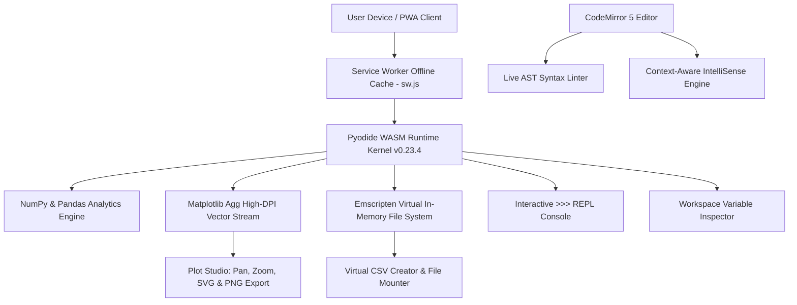

<div align="center">

# ⚡ Omni-Studio
### High-Performance Offline Computational Python & Data Science Lab

[](https://shadow-wave.github.io/Omni-pro/)
[](https://shadow-wave.github.io/Omni-pro/)
[](https://pyodide.org/)
[](LICENSE)

<p align="center">
  A mobile-first, client-side Python 3 IDE executing natively inside the browser through WebAssembly.<br>
  <b>Zero Cloud Backend • 100% Client-Side Privacy • Real-Time AST Linting • High-DPI Responsive Plot Studio</b>
</p>

[🚀 **Launch Omni-Studio in Browser**](https://shadow-wave.github.io/Omni-pro/)

---

</div>

## 🌟 Overview

**Omni-Studio** is an advanced computational development suite built for students, physics & mathematics researchers, and data science learners. It delivers a desktop-grade Python 3 IDE experience directly on smartphones, tablets, iPads, and PCs without requiring local Python installations or server infrastructure.

Powered by **Pyodide (WebAssembly)**, Omni-Studio operates completely offline via Progressive Web App (PWA) caching, executing complex NumPy calculations, Pandas manipulations, and Matplotlib visualizations in real time inside client browser memory.

---

## ⚡ Core Architecture & Engineering

Omni-Studio coordinates CodeMirror, an in-memory virtual filesystem, a background AST linter, and the WebAssembly runtime:



---

## 🚀 Key Technical Highlights & Capabilities

### 1. 🖥️ Resizable Dual-Pane Split View
* **Side-by-Side Workflow**: Toggle split mode (`Alt + S`) to display the code editor on the left and output panels (Terminal Console, Plot Studio, Variable Explorer, Syllabus) on the right.
* **Draggable Divider**: Adjust pane distribution freely (from 20% to 80%) with mouse or multi-touch dragging. Double-clicking the divider restores a 50/50 ratio.
* **Auto-Dock Hiding**: When split mode is active, the bottom mobile dock hides automatically, dedicating full screen height to workspace panels.
* **Responsive Layout**: Automatically activates split view on desktop screens ($\ge 1024\text{px}$) and adapts smoothly to portrait mode on mobile devices.

### 2. 🔍 Real-Time Keystroke AST Linter
* Continuous in-flight syntax analysis parses Python code without executing it.
* Flags missing colons (`:`), unmatched parentheses/brackets, and syntax mistakes immediately with red wavy underlines and gutter warning badges.

### 3. 📈 Multi-Device Responsive Plot Studio
* **Infinite Pan & Zoom**: Examine dense curves with mouse wheel zooming, touch pinching, and smooth drag-panning.
* **Vector & Raster Exports**: Export generated graphs as crisp high-DPI PNGs or scalable SVGs with a single tap.
* **Direct Clipboard Copy**: Copy plot images directly to the system clipboard for pasting into reports or chat apps.
* **Filmstrip Carousel**: Switch between multiple figures produced during a session.

### 4. 🧭 Interactive Element-Pointing Spotlight Tour
* First-time visitors receive an interactive step-by-step walkthrough highlighting actual buttons (Split View, Line Execution, Linter, Find & Replace).
* Can be restarted at any time from the Help Guide (`F1`).

### 5. 🔍 Find & Replace Tool
* Built-in search panel (`Ctrl + F` / `Ctrl + H`) with real-time match highlighting, match counters, next/previous navigation, and batch replacement.

### 6. 🪄 Intelligent Code Auto-Formatter
* Automatically indents Python blocks, loops, functions, and control structures according to standard 4-space conventions (`Shift + Alt + F`).

### 7. 💻 Interactive Python REPL Console
* Direct `>>>` expression evaluator inside the Console tab.
* Supports Command History (Up/Down arrow navigation) for rapid iterative calculation.
* Console session log export feature (`.txt` download or native device share sheet).

### 8. 📊 Workspace Memory & DataFrame Inspector
* Inspect live global variables, types, and array dimensions (`shape`).
* Full-screen modal inspector for Pandas DataFrames with scrollable tabular data and NumPy array representations.

### 9. 🗂️ Virtual CSV Spreadsheet & Dataset Mount
* Built-in visual table editor: create datasets in memory, add rows/columns, edit cells, or switch to raw CSV text.
* Mount external `.csv`, `.txt`, and `.pdf` files into the Emscripten virtual filesystem.

### 10. 📦 Dynamic PyPI Dependency Resolver
* Automatically scans code for imported libraries (such as `pypdf`, `sympy`, `scipy`) and installs missing packages on demand via `micropip`.

### 11. ⏱️ Non-Blocking Terminal `input()` Handling
* An AST node transformer pauses execution smoothly for `input()`, `int(input())`, and `float(input())` calls via a modal dialog without blocking the browser thread.

---

## ⌨️ Keyboard Shortcuts Reference

Omni-Studio includes comprehensive desktop keyboard shortcuts for maximum coding speed:

| Shortcut | Action | Scope |
|:---|:---|:---|
| <kbd>Ctrl</kbd> + <kbd>Enter</kbd> / <kbd>Cmd</kbd> + <kbd>Enter</kbd> | **Run Full Script** | Workspace |
| <kbd>F9</kbd> / <kbd>Shift</kbd> + <kbd>Enter</kbd> | **Run Selected Block or Current Line** | Editor |
| <kbd>Alt</kbd> + <kbd>S</kbd> | **Toggle Dual-Pane Split View** | Workspace |
| <kbd>Ctrl</kbd> + <kbd>F</kbd> / <kbd>Cmd</kbd> + <kbd>F</kbd> | **Open Find Modal** | Editor |
| <kbd>Ctrl</kbd> + <kbd>H</kbd> / <kbd>Cmd</kbd> + <kbd>H</kbd> | **Open Find & Replace Modal** | Editor |
| <kbd>Shift</kbd> + <kbd>Alt</kbd> + <kbd>F</kbd> | **Auto-Format Python Indentation** | Editor |
| <kbd>F1</kbd> | **Open Help Guide & Tour Launcher** | Workspace |
| <kbd>Esc</kbd> | **Close Open Modals** | Dialogs |

---

## 📚 Prescribed University Lab Syllabus Experiments

Pre-configured experiments adhering to standard undergraduate computational physics and computer science curricula:

| Exp | Title | Concept & Applied Methods | Primary Output |
|:---:|:---|:---|:---:|
| **01** | Arithmetic Operations | Floating point input ingestion, operators (`+`, `-`, `*`, `/`) | Console |
| **02** | List Sorting Algorithm | Dynamic element collection, in-place `list.sort()` | Console |
| **03** | Parity Verification | Modulo arithmetic condition (`% 2 == 0`) with branching | Console |
| **04** | Factorial Computation | Iterative product loop with negative and zero boundary handling | Console |
| **05** | Prime Number Verification | Square-root bounded factor search optimization (`int(n**0.5) + 1`) | Console |
| **06** | Duplicate Tuple Detection | Pandas series identification with `df.duplicated()` | Tabular Series |
| **07** | Pivot Table Aggregation | Category summation using `pd.pivot_table(..., aggfunc='sum')` | Pivot Summary |
| **08** | GroupBy Dataset Partition | Multi-entity grouping using `df.groupby('school')` iteration | Grouped Frames |
| **09** | Comparative Bar Chart | Categorical visualization with `plt.bar()`, custom colors & ticks | Plot Studio |
| **10** | Daily Activity Pie Chart | Proportional analytics with `plt.pie()`, explode, and shadow | Plot Studio |

---

## 📲 Offline Installation (PWA)

Omni-Studio functions as a fully offline Progressive Web App. Once loaded, all dependencies and compiler engines reside in client cache.

### Android / Chrome
1. Visit [https://shadow-wave.github.io/Omni-pro/](https://shadow-wave.github.io/Omni-pro/).
2. Tap the browser options menu (three dots) $\rightarrow$ **Install App** / **Add to Home screen**.
3. Launch directly from the home screen or app drawer with native standalone display.

### iOS / iPadOS (Safari)
1. Open the URL in Safari.
2. Tap the **Share** button $\rightarrow$ select **Add to Home Screen**.
3. Launch full-screen without Safari browser address bars.

### Windows / macOS / Linux (Chrome & Edge)
1. Open the URL in Google Chrome or Microsoft Edge.
2. Click the **Install Omni-Studio** icon located on the right side of the address bar.
3. Omni-Studio will launch in its own independent workstation window.

---

## 🛠️ Technology Stack

* **Core Runtime**: Pyodide (Python 3.11 compiled to WebAssembly via Emscripten)
* **Pre-bundled Libraries**: `numpy`, `pandas`, `matplotlib`, `micropip`
* **Editor Component**: CodeMirror 5 (Python syntax mode, active-line highlight, search cursor)
* **Styling & UI**: Tailwind CSS, FontAwesome 6, Plus Jakarta Sans & JetBrains Mono typography
* **Client Caching**: Service Worker Cache API with stale-while-revalidate strategy

---

## 📁 Repository Structure

```text
Omni-pro/
├── index.html       # Complete Single-File IDE (Markup, CSS, Editor Engine, Pyodide WASM Bridge)
├── sw.js            # Production Service Worker (Offline-First Cache & WASM Stream)
├── manifest.json    # Progressive Web App Manifest & App Launch Shortcuts
├── README.md        # Technical Documentation & Architectural Specification
└── LICENSE          # MIT Open Source License
```

---

## 👨‍💻 Author & Academic Maintainer

**Aravind O K**  
*Department of Physics, Mahatma Gandhi College, Iritty*  
*Affiliated with Kannur University, Kerala, India*  
GitHub: [@shadow-wave](https://github.com/shadow-wave)  
Repository: [shadow-wave/Omni-pro](https://github.com/shadow-wave/Omni-pro)

---

## 📄 License

This software is distributed under the terms of the **MIT License**. See the [LICENSE](LICENSE) file for complete details.
