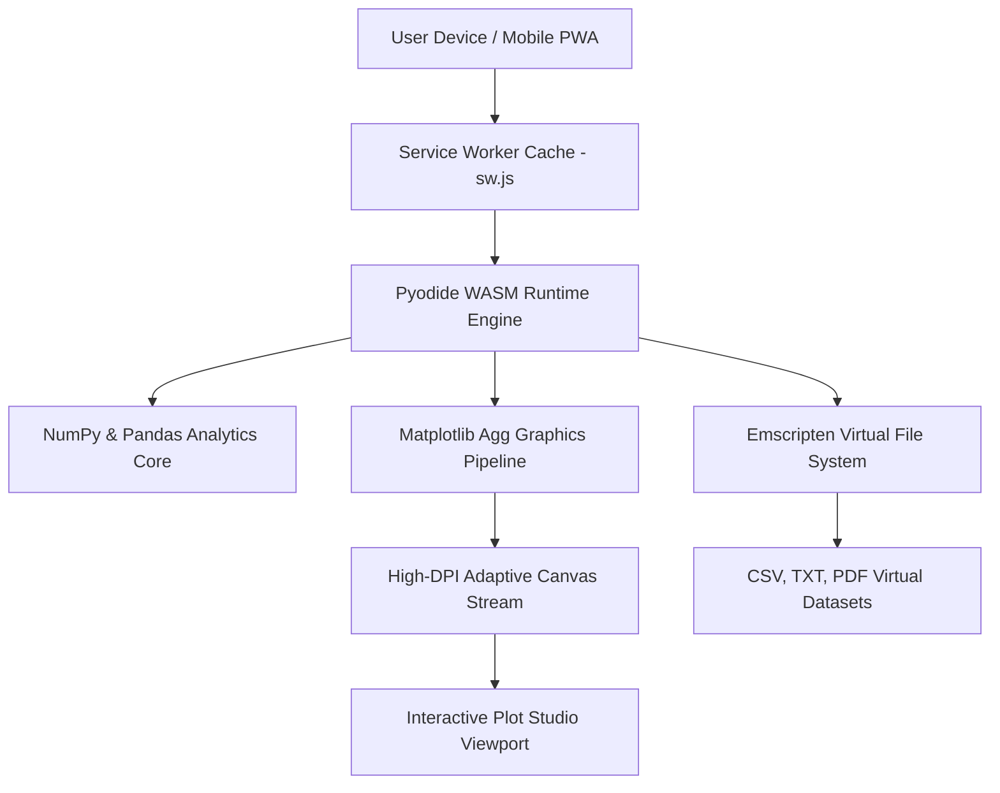

# ⚡ Omni-Studio
### High-Performance Offline Computational Python & Data Science Lab

  A mobile-first, zero-install Python environment executing natively inside the browser through WebAssembly. 
  <b>Zero Server Infrastructure • Seamless Offline Persistence • Professional Diagnostics & Plotting</b>

[🚀 **Launch Omni-Studio in Browser**](https://shadow-wave.github.io/Omni-pro/)

---

## 🌟 Overview

**Omni-Studio** is an interactive computational suite developed for students, educators, and researchers. It delivers a comprehensive Python 3 development experience directly in web browsers on smartphones, tablets, and laptops without requiring Python installations or external servers.

Equipped with a live WebAssembly kernel, real-time code diagnostics, context-sensitive autocompletion, high-resolution graphic outputs, and an in-memory virtual filesystem, it bridges the gap between desktop workstations and mobile study.

---

## ⚡ Core Architecture & Engineering Highlights

### Key Technical Capabilities

* 🚀 **Fluid 60 FPS Boot Pipeline**: Custom spring-interpolated loader tracking every kernel lifecycle phase (Pyodide core, micropip, NumPy, Pandas, Matplotlib, and filesystem initialization) with live percentage feedback.
* 🔍 **Real-Time Keystroke Linting**: In-flight AST syntax parser immediately highlights syntax bugs, unclosed brackets, and missing `:` statement terminators with wavy error markings and gutter alerts.
* 💡 **Dynamic IntelliSense Engine**:
  * Autocompletion for `np.` (NumPy), `pd.` (Pandas), `plt.` (Matplotlib), and `df.` (DataFrames).
  * Automatic workspace scanning that registers and surfaces user-declared variables with distinctive badges.
* 📈 **Adaptive Multi-Device Plot Studio**: Dynamic viewport constraints ensure graphs (Bar Charts, Pie Charts, Scatter Fits) adapt gracefully to smartphones, iPads, and ultrawide laptop monitors without title clipping or distortion.
* 📊 **Interactive Variable Explorer & DataFrame Inspector**: Live workspace memory inspector detailing variable names, types, dimensions, and values, accompanied by a full-table inspector modal for Pandas DataFrames.
* ⚡ **Line / Selection Execution**: Execute highlighted code blocks or individual lines interactively with single-keystroke simplicity.
* 📦 **Automated PyPI Dependency Resolver**: Automatically identifies missing imports (e.g., `pypdf`, `sympy`) and downloads them on demand via client-side package management.
* 🗂️ **Virtual CSV & Document Manager**: Interactive visual spreadsheet editor supporting row/column addition, direct cell editing, raw CSV toggling, and file upload/download capabilities.

---

## 📚 University Lab Syllabus Modules

Omni-Studio includes a structured reference catalog containing standard university curriculum lab experiments with verified execution outputs:

| Experiment | Title | Description / Methods Applied | Output Format |
|:---:|:---|:---|:---:|
| **01** | Arithmetic Operations | Terminal float ingestion, operators (`+`, `-`, `*`, `/`) | Console Output |
| **02** | List Sorting Algorithm | Dynamic input array parsing, `numbers.sort()` | Console Output |
| **03** | Parity Verification | Modulo condition check (`% 2 == 0`) with conditional branching | Console Output |
| **04** | Factorial Computation | Iterative product loop with zero/negative bounds validation | Console Output |
| **05** | Prime Number Verification | Square-root bounded factor analysis (`int(n**0.5) + 1`) | Console Output |
| **06** | Duplicate Tuple Detection | Pandas series extraction using `df.duplicated()` | Boolean Series Table |
| **07** | Pivot Table Aggregation | Category summation using `pd.pivot_table(..., aggfunc='sum')` | Aggregated Pivot Table |
| **08** | GroupBy Dataset Partition | Categorical multi-entity splitting with `df.groupby('school')` | Grouped Output Frames |
| **09** | Comparative Bar Chart | Categorical visualization with `plt.bar()`, grid styling, labels | High-DPI Plot |
| **10** | Daily Activity Pie Chart | Proportional distribution with `plt.pie()`, explode, legend | High-DPI Plot |

---

## 📲 Offline Installation (PWA)

Omni-Studio complies with the Progressive Web App standard:

### On Mobile Devices (Android / iOS)
1. Open [https://shadow-wave.github.io/Omni-pro/](https://shadow-wave.github.io/Omni-pro/) in Safari, Chrome, or Firefox.
2. Select **Add to Home Screen** from the browser menu.
3. Launch Omni-Studio as a standalone app with complete offline caching.

### On Laptops & Desktops (Chrome / Edge)
1. Open the URL.
2. Click the **Install** icon in the address bar.
3. Access Omni-Studio in its own dedicated distraction-free window.

---

## 👨‍💻 Author & Maintainer

**Aravind O K**  
*Department of Physics, Mahatma Gandhi College, Iritty*  
*Affiliated with Kannur University, Kerala, India*  
GitHub: [@shadow-wave](https://github.com/shadow-wave)

---

## 📄 License

This software is released under the terms of the [MIT License](LICENSE).
